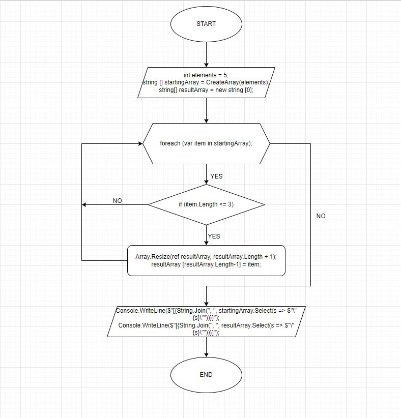

# **Итоговая контрольная работа по основному блоку.**
## **Задача**: 
### Написать программу, которая из имеющегося массива строк формирует новый массив из строк, длина которых меньше, либо равна 3 символам. Первоначальный массив можно ввести с клавиатуры, либо задать на старте выполнения алгоритма. При решении не рекомендуется пользоваться коллекциями, лучше обойтись исключительно массивами.
## *Примеры:*
+ [“Hello”, “2”, “world”, “:-)”] → [“2”, “:-)”]
+ [“1234”, “1567”, “-2”, “computer science”] → [“-2”]
+ [“Russia”, “Denmark”, “Kazan”] → []
## **Решение:**
+ Задаем количество элементов, из которых будет состоять массив.
+ Создаем массив **startingArray** типа **string**. 
+ Создаем функцию **CreateArray** типа **string**, которая принимает в себя текстовый массив. Задача этой функции реализовать заполнение массива с клавиатуры пользователем через цикл *for*. На выходе получаем заполненый массив.
+ Создаем новый массив **resultArray** типа **string**, который будем заполнять элементами из первого массива, длина которых не превышает 3, используя *foreach*.
+ Последним этапом распечатываем 2 массива: **startingArray** и **resultArray**.

### Решение задачи отображает следующая блок-схема:

